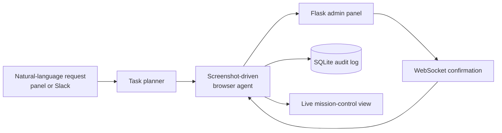

# TaskPilotIT — Screenshot-Driven IT Support Agent

AI-powered IT admin panel where an agent navigates a real browser using screenshots,
streams every step live to a mission-control UI, and confirms actions via WebSocket.


## Project snapshot

| Verified or documented capability | Count |
| --- | ---: |
| Flask admin routes | **5** |
| Included demonstration workflows | **5** |
| Launch modes: panel, CLI agent, Slack | **3** |
| Configured LLM providers | **2** |
| Tracked browser-run screenshots | **14** |

## Workflow preview



> **Safety:** agent runs mutate user, password, and license state. Use only the
> included demo panel until authentication, authorization, CSRF protection, and
> recovery procedures have been reviewed. Existing run screenshots are not
> embedded here because they have not been cleared for identifiable data.

## Detailed architecture

```
Natural language request (UI or Slack)
             │
             ▼
    [Task Planner]  ← Groq / Llama-3.3-70b  (free)
    NL → numbered browser navigation steps
             │
             ▼
    [Browser Agent] ← Browser Use + Gemini 2.0 Flash  (free, has vision)
    Opens real Chromium, navigates by sight — no DOM shortcuts
             │
       Every step:
         ├── Screenshot → base64 → WebSocket → /agent page (live view)
         ├── Step description → WebSocket → chat feed
         └── Form submit → panel action → WebSocket event → confirmed
             │
             ▼
    [Flask Admin Panel] ← SQLite + Flask-SocketIO
    Renders navigable UI  +  emits structured events
             │
             ▼
    [Logs DB]  — every panel action + agent step persisted, viewable at /logs
```

## Pages

| Route | What it does |
|-------|-------------|
| `/` | Dashboard — stats, recent users, recent agent runs |
| `/users` | Create / reset password / enable-disable users |
| `/licenses` | Assign basic / pro / enterprise licenses |
| `/logs` | Full activity log, filterable by source (panel / agent), live stream |
| `/agent` | Chat with the AI agent — live browser screenshot viewer, step feed |

---

## Quick Start

### 1. Install

```bash
git clone https://github.com/Sriman-Kunda-056/TaskPilotIT.git
cd TaskPilotIT
python -m venv .venv
# Linux/macOS: source .venv/bin/activate
# Windows: .venv\Scripts\activate
pip install -r requirements.txt
playwright install chromium
```

### 2. Provider API keys

| Key | Provider |
|-----|----------|
| `GEMINI_API_KEY` | [Google AI Studio](https://aistudio.google.com/app/apikey) |
| `GROQ_API_KEY` | [Groq Console](https://console.groq.com/keys) |

Provider pricing, quotas, and model availability change over time; verify the
current terms before running the agent.

```bash
cp env.example .env
# Paste both keys into .env
```

### 3. Run

```bash
# Terminal 1 — admin panel
python panel/app.py

# Terminal 2 — CLI agent (optional, panel has built-in agent UI)
python main.py
```

Open **http://localhost:5000/agent** — type a task, watch the browser navigate live.

---

## Using the Agent UI

1. Go to `http://localhost:5000/agent`
2. Type any IT request or click a quick-fill preset:
   - `Reset password for alice@company.com`
   - `Check if john@company.com exists, if not create them then assign pro license`
   - `Disable bob@company.com`
3. Watch the right panel — live Chromium screenshots stream as the agent navigates
4. Watch the left panel — every step and panel event appears in the chat feed
5. Go to `/logs` to see the full persistent audit trail

---

## Slack Integration (Bonus)

Setup takes ~10 minutes, fully free:

1. [api.slack.com/apps](https://api.slack.com/apps) → Create New App → From Scratch
2. **OAuth & Permissions** → Bot Token Scopes: `app_mentions:read`, `chat:write`
3. **Settings → Socket Mode** → Enable → Create App-Level Token → copy as `SLACK_APP_TOKEN`
4. **Event Subscriptions** → Subscribe to `app_mention`
5. Install to workspace → copy Bot Token as `SLACK_BOT_TOKEN`
6. Add both to `.env`, then:

```bash
python slack_bot.py
```

In Slack: `@YourBot reset password for alice@company.com`

---

## Deployment

### Railway (free tier)
```bash
npm i -g @railway/cli
railway login && railway init
railway variables set GEMINI_API_KEY=... GROQ_API_KEY=...
railway up
```

### Docker
```bash
docker compose up panel          # just the panel
docker compose --profile agent up  # panel + agent
docker compose --profile slack up  # panel + slack bot
```

---

## What makes this different

**Screenshot-based navigation** — the agent literally looks at the screen (via Gemini Flash vision) and decides where to click. No hardcoded selectors, no API shortcuts.

**Dual feedback loop** — the agent doesn't just click and hope. The panel emits WebSocket events after every action (`user_created`, `password_reset`, etc.), which the agent subscribes to and uses to confirm success and decide next steps.

**Live streaming** — every Chromium screenshot during the agent run is base64-encoded and broadcast over WebSocket to the `/agent` page in real time. You watch it happen.

**Full audit trail** — every panel action and every agent step is logged to SQLite and visible at `/logs`, filterable by source, with a live-updating stream at the bottom.
